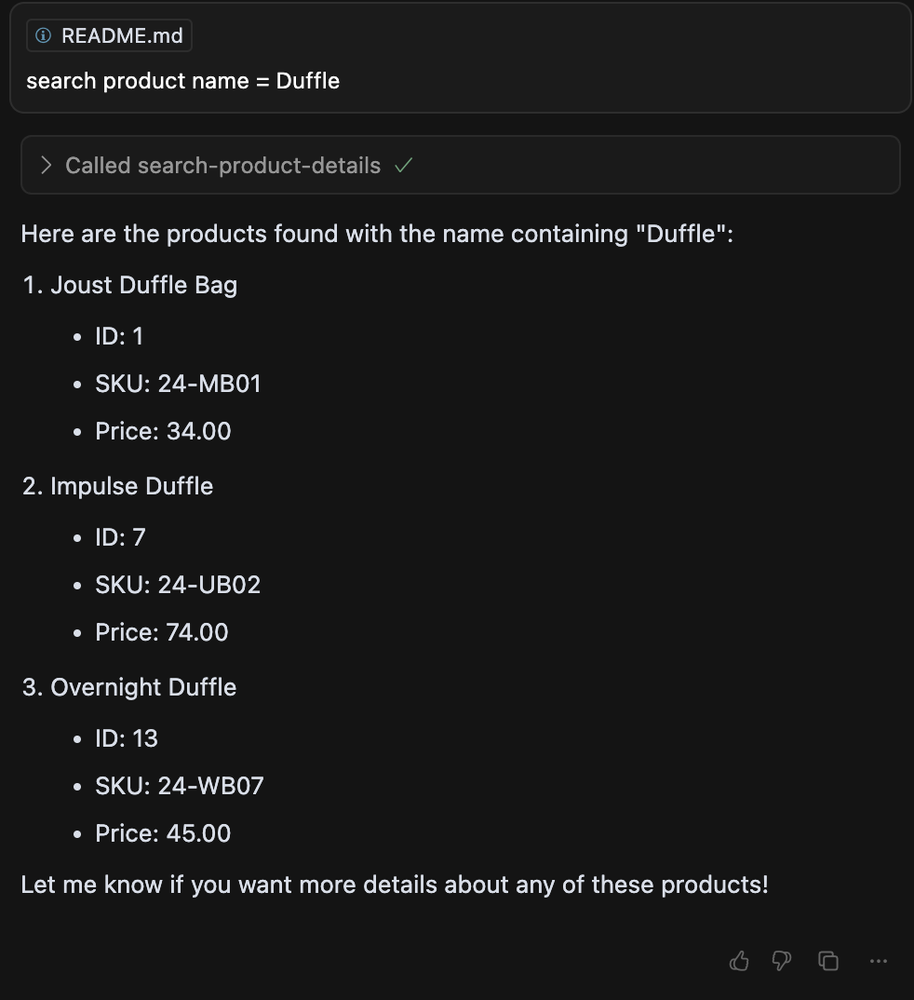

# @iranimij/magento-mcp-remote-server

A remote Model Context Protocol (MCP) server for integrating with the [Magento 2 MCP server module](https://github.com/iranimij/magento-mcp-server). This library provides a CLI server that exposes tools for demonstration and for fetching product details from a Magento backend. It is intended to be used in conjunction with the Magento 2 module to enable AI and remote automation features for your Magento store.

## Installation

```bash
npm install -g @iranimij/magento-mcp-remote-server
```
Or, for local development:
```bash
git clone <this-repo-url>
cd mcp
npm install
npm run build && npm run bundle
```

## Usage

Add the following to your cursor MCP settings:

```json
"testServer": {
  "command": "npx",
  "args": ["@iranimij/magento-mcp-remote-server"],
  "env": {
    "MAGENTO_API_URL": "https://app.magento.test/",
    "MAGENTO_ADMIN_USERNAME": "admin",
    "MAGENTO_ADMIN_PASSWORD": "admin1234"
  }
},
```

### As a CLI

```bash
npx magento-mcp-remote-server
```

Or, if running locally after build:
```bash
node dist/bundle.cjs
```

### Environment Variables

- `MAGENTO_API_URL` (required): The base URL of your Magento API (e.g., `https://your-magento-site.com`).
- (Optional) You may add authentication headers in `index.ts` if your Magento API requires a token.

---

## Tools

This server exposes the following tools. Click each tool for detailed documentation:

- [get-product-details](docs/get-product-details.md): Fetch product details for a given product ID from the Magento API.
- [get-todays-orders](docs/get-todays-orders.md): Fetch all orders placed today from the Magento API.
- [create-customer](docs/create-customer.md): Create a new customer in Magento.
- [create-simple-product](docs/create-simple-product.md): Create a new simple product in Magento.
- [search-product-details](docs/search-product-details.md): Search for product details by SKU, name, or ID from the Magento API.

---

### Example Output

Below is an example output for a product search using the `search-product-details` tool:



---

## Development

- Written in TypeScript. Source in `src/`.
- Easily extensible with custom tools.
